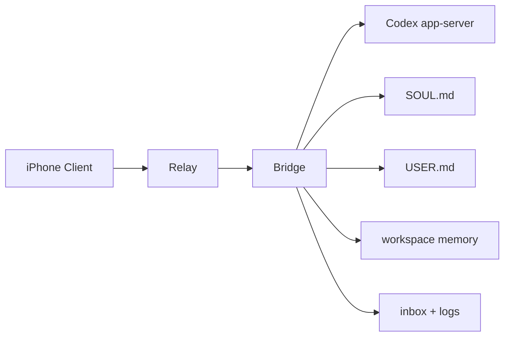

# Codex-Claw

Codex-Claw is an openclaw-style mobile layer for Codex.

It lets an iPhone talk to a local Codex `app-server` through a Relay + Bridge architecture, while adding persistent agent state with `SOUL`, `USER`, workspace memory, inbox memory, and native Codex thread import.

Short version: this is "openclaw for Codex", with durable personality and memory instead of a stateless websocket bridge.

中文说明：Codex-Claw 可以理解为 Codex 版本的 openclaw。它通过 Relay + Bridge 架构，让 iPhone 可以远程连接本地的 Codex `app-server`，同时补上 `SOUL`、`USER`、workspace memory、inbox memory 和原生 Codex 线程导入这些持久化能力，不再只是一个无状态的 websocket 转发层。

## Why People Star It

- remote Codex access from iPhone
- openclaw-style persistent `SOUL` and `memory`
- per-workspace context instead of one flat global prompt
- pairing and trusted-device flow for a single personal device
- file-based memory that is easy to inspect, edit, and version
- works with Cloudflare Tunnel for internet access

## Good Fit

- you want Codex on your Mac, but usable from your phone
- you want a persistent agent instead of a fresh session every turn
- you want editable local files for identity, preferences, and memory
- you want something simpler and more hackable than a full backend stack

## Architecture



## What It Does

- runs a local WebSocket relay
- starts and manages `codex app-server`
- bridges mobile requests to Codex
- supports pairing and trusted-device persistence
- can expose the relay through Cloudflare Quick Tunnel
- injects file-based agent memory before each turn

## What Makes It Openclaw-Style

- `SOUL.md`: durable assistant identity, style, and behavior rules
- `USER.md`: stable user preferences and collaboration habits
- `memory/global.md`: cross-workspace long-term memory
- `memory/profile.md`: durable profile and preference memory
- `memory/workspaces/<id>.md`: per-workspace project memory
- `memory/inbox.jsonl`: durable turn-by-turn summaries
- `memory/workspace-logs/<id>.jsonl`: workspace-specific interaction logs
- native Codex thread import into durable memory

This makes Codex-Claw closer to an openclaw-style persistent agent layer than a plain websocket proxy.

## Comparison

| Capability | Basic remote bridge | Codex-Claw |
| --- | --- | --- |
| iPhone to Codex remote access | Yes | Yes |
| Pairing and trusted-device flow | Sometimes | Yes |
| Durable assistant identity | No | Yes |
| Durable user preference memory | No | Yes |
| Per-workspace memory files | No | Yes |
| Durable inbox and workspace logs | No | Yes |
| Import recent native Codex threads | No | Yes |
| Editable local text files instead of DB-only state | Rarely | Yes |

## Core Files

- `agent/SOUL.md`: assistant identity and style
- `agent/USER.md`: stable user preferences
- `agent/memory/global.md`: cross-project memory
- `agent/memory/profile.md`: durable profile memory
- `agent/memory/workspaces/<id>.md`: project-specific memory
- `agent/memory/inbox.jsonl`: durable summaries after each turn
- `agent/memory/workspace-logs/<id>.jsonl`: per-workspace logs

## Project Layout

- `src/relay.ts`: relay server
- `src/bridge.ts`: bridge between relay and local Codex app-server
- `src/createPairingSession.ts`: one-time pairing code generator
- `src/agentMemory.ts`: file-based soul, user, and memory scaffolding
- `src/nativeCodexMemorySync.ts`: imports recent Codex native threads into durable memory
- `bridge.config.example.json`: example bridge configuration

## Requirements

- Node.js 18+
- `codex` CLI available in `PATH`
- optional: `cloudflared` for internet exposure

## Setup

```bash
cd Codex-Claw
npm install
cp bridge.config.example.json bridge.config.json
```

Edit `bridge.config.json` and set:

- `bridgeId`
- `bridgeName`
- `relayUrl`
- `codexListenUrl`
- `workspaces[].cwd`

The first bridge run will scaffold local context files under `agent/`.

## Quick Start

Terminal 1:

```bash
npm run relay
```

Terminal 2:

```bash
RELAY_BRIDGE_TOKEN=your-secret npm run bridge -- /absolute/path/to/bridge.config.json
```

Terminal 3:

```bash
npm run pair -- /absolute/path/to/bridge.config.json
```

## Run

Start the relay:

```bash
npm run relay
```

Start the bridge in another terminal:

```bash
RELAY_BRIDGE_TOKEN=your-secret npm run bridge -- /absolute/path/to/bridge.config.json
```

Create a one-time pairing code:

```bash
npm run pair -- /absolute/path/to/bridge.config.json
```

Optional Cloudflare Quick Tunnel:

```bash
npm run tunnel:quick
```

The included `.gitignore` keeps local device data, pairing records, agent memory, and private config out of Git.
